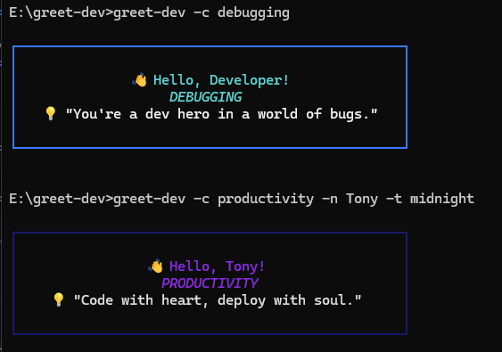

# Greet-Dev CLI

A simple, elegant CLI tool to greet developers with motivational quotes. Built with Node.js and pnpm.

---

## Features

- Personalized greetings with customizable names.
- Multiple themes (dark, light, neon) for stylish terminal output.
- 50+ curated quotes to inspire developers.
- Choose the quote categories you need at the moment!
- Lightweight and fast, with easy setup.

---

## Installation

You can use `npx` for a quick start:

```bash
npx greet-dev
npx greet-dev -n Alice
npx greet-dev -n Bob -t neon
```

Or install globally:

```bash
npm install -g greet-dev
greet-dev
greet-dev -n Alice
greet-dev -n Bob -t neon
```

---

## Screenshot



---

## Usage

- Default greeting: `greet-dev`
- Personalized greeting: `greet-dev -n Alice`
- Themed greeting: `greet-dev -n Bob -t neon`
- Choose category : `greet-dev -c productivity -n Tony -t midnight`
- Show version: `greet-dev --version`
- Show help: `greet-dev --help`

---

## Available Themes

- **dark** (default): Cyan name, white quote, blue border.
- **light**: Blue name, black quote, gray border.
- **neon**: Magenta name, green quote, yellow border.
- **midnight**: Blue-violet name, light-grey quote, midnigth border.

- Explore `data/themes.js` file to know more.
---

## Project Structure

```
greet-dev/
├── node_modules/        #  Dependencies
├── data/                # Data files
│   └── quotes.json      # Motivational quotes
├── index.js             # Main CLI script
├── package.json         # Project metadata
└── README.md            # Documentation
```

